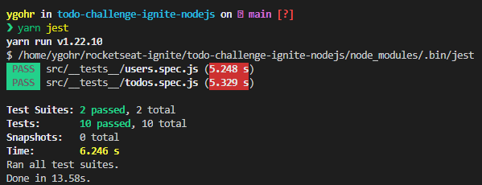

# ⚔️ Ignite - Desafio 1 : Conceitos Node.JS

<br>

## :pushpin: Sobre o Desafio
Este desafio tem como objetivo o desenvolvimento de uma aplicação gerenciadora de **Tarefas** (_To-dos_), associadas a um **usuário**. 
As funcionalidades presentes são:
- Criar uma nova tarefa
- Listar todas as tarefas
- Alterar o título e prazo de uma tarefa existente
- Marcar uma tarefa como feita
- Excluir uma tarefa

O _template_ de arquivos utilizados neste projeto pode ser acessado em: [**template.**](https://github.com/rocketseat-education/ignite-template-conceitos-do-nodejs)

## 📋 Requisitos e Regras de Negócio
O documento de referência de Requisitos e Regras de Negócio pode acessado através deste [**link.**](https://www.notion.so/Requisitos-e-Regras-de-Neg-cio-TodosAPI-639401aa8c6f4b48b5aa1db7c53ab107)

## 💻 Instalação, Dependências e Executando o Projeto
**1.** Clone este repositório 
```
git clone https://github.com/Ygohr/todo-challenge-ignite-nodejs
``` 
**2.** Vá até o diretório raiz do projeto
```
cd todo-challenge-ignite-nodejs
``` 
**3.** Instale as dependências necessárias
```
yarn 
ou
npm install
```
**4.** Execute a aplicação
```
yarn dev
```

## :syringe: Evidência de Testes
Nesta aplicação, são contemplados **Testes Unitários**, visando garantir o correto funcionamento das funcionalidades e manter a aplicação de acordo com os requisitos. <br/>

